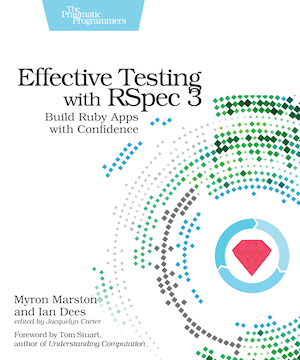

[](https://gitpitch.com/enogrob/ebook-project/master)
```
Roberto Nogueira  
BSd EE, MSd CE
Solution Integrator Experienced - Certified by Ericsson
```
# eBook Effective Testing with RSpec 3



**About**

Learn everything you need to about the subject of this `eBook` project.

[Homepage](https://pragprog.com/book/rspec3/effective-testing-with-rspec-3)

## Topics
```
[x] Introduction

Part-I Getting Started
1. Getting Started With RSpec
[x] Installing RSpec
[x] Your First Spec
[x] Understanding Failure
[x] Sharing Setup (But Not Sandwiches)
[x] Your Turn
2. From Writing Specs to Running Them excerpt
[x] Customizing Your Specs’ Output
[x] Identifying Slow Examples
[x] Running Just What You Need
[x] Marking Work in Progress
[x] Your Turn
3. The RSpec Way
[x] What Your Specs Are Doing for You
[x] Comparing Costs and Benefits
[x] Different Types of Specs
[x] Guidelines
Part-II Building an App With RSpec 3
4. Starting On the Outside: Acceptance Specs
[x] First Steps
[x] Deciding What to Test First
[x] Checking the Response
[x] Filling In the Response Body
[x] Querying the Data
[x] Saving Your Progress: Pending Specs
[x] Your Turn
5. Testing in Isolation: Unit Specs
[ ] From Acceptance Specs to Unit Specs
[ ] Filling In the First Spec
[ ] Handling Success
[ ] Refactoring
[ ] Handling Failure
[ ] Defining the Ledger
[ ] Your Turn
6. Getting Real: Integration Specs
[ ] Hooking Up the Database
[ ] Testing Ledger Behavior
[ ] Testing the Invalid Case excerpt
[ ] Isolating Your Specs Using Database Transactions
[ ] Filling In the Behavior
[ ] Querying Expenses
[ ] Ensuring the Application Works for Real
[ ] Your Turn
Part-III RSpec Core
7. Structuring Code Examples
[ ] Getting the Words Right
[ ] Sharing Common Logic
[ ] Sharing Example Groups
[ ] Your Turn
8. Slicing and Dicing Specs with Metadata
[ ] Defining Metadata
[ ] Reading Metadata
[ ] Selecting Which Specs to Run
[ ] Sharing Code Conditionally
[ ] Changing How Your Specs Run
[ ] Your Turn
9. Configuring RSpec
[ ] Command-Line Configuration
[ ] Setting Command-Line Defaults
[ ] Using a Custom Formatter
[ ] RSpec.configure
[ ] Your Turn
Part-IV RSpec Expectations
10. Exploring RSpec Expectations
[ ] Parts of an Expectation
[ ] How Matchers Work
[ ] Composing Matchers
[ ] Generated Example Descriptions
[ ] Your Turn
11. Matchers Included in RSpec Expectations
[ ] Primitive Matchers
[ ] Higher-Order Matchers
[ ] Block Matchers
[ ] Your Turn
12. Creating Custom Matchers
[ ] Delegating to Existing Matchers Using Helper Methods
[ ] Defining Matcher Aliases
[ ] Negating Matchers
[ ] Using the Matcher DSL
[ ] Defining a Matcher Class
[ ] Your Turn
Part-V RSpec Mocks
13. Understanding Test Doubles
[ ] Types of Test Doubles
[ ] Usage Modes: Mocks, Stubs, and Spies
[ ] Origins: Pure, Partial, and Verifying Doubles excerpt
[ ] Your Turn
14. Customizing Test Doubles
[ ] Configuring Responses
[ ] Setting Constraints
[ ] Your Turn
15. Using Test Doubles Effectively
[ ] Constructing Your Test Environment
[ ] Stubject (Stubbing the Subject)
[ ] Using Partial Doubles Effectively
[ ] Connecting the Test Subject to Its Environment
[ ] The Risks of Mocking Third-Party Code
[ ] High-Fidelity Fakes
[ ] Faking I/O with StringIO
[ ] Wrapping a Third-Party Dependency
[ ] Your Turn
```
